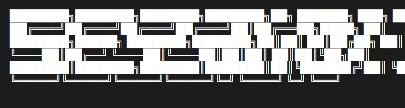
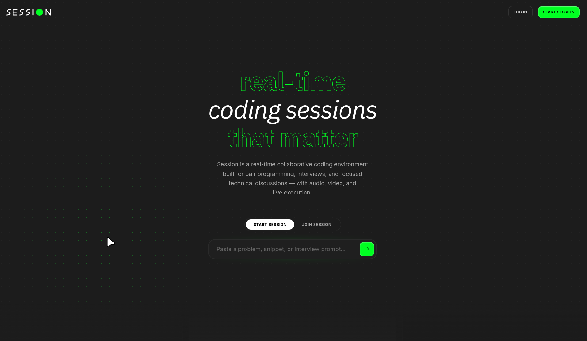

<div align="center">
  
  
  <p>
    Get 10X more out of your pair programming sessions.
  </p>

  <p>
    
    
    
  </p>
  
  <br />
<hr />
<br/>
  <br/>
  <br/>

  
  <br/>
  <br/>
  <br/>
</div>

Session is a real-time collaborative coding environment built for pair programming, interviews, and focused technical discussions — with audio, video, and live execution.

## Project Structure

- **frontend/**: React application (Vite + Tailwind CSS v4).
- **backend/simple-ws-server/**: Node.js WebSocket server using Yjs for real-time synchronization.

## Getting Started

### Prerequisites

- Node.js and npm installed.

### Backend

1. Navigate to the server directory:
   ```bash
   cd backend/simple-ws-server
   ```
2. Install dependencies:
   ```bash
   npm install
   ```
3. Start the server:
   ```bash
   npm start
   ```
   The server listens on port `1234` by default.

### Frontend

1. Navigate to the frontend directory:
   ```bash
   cd frontend
   ```
2. Install dependencies:
   ```bash
   npm install
   ```
3. Run the development server:
   ```bash
   npm run dev
   ```
4. Open your browser and navigate to `http://localhost:5173`.

## Deployment

### Production URLs

- **Frontend**: https://mock-collab-editor.onrender.com

### Deployment Configuration

**Backend (Render)**

- Root Directory: `backend/simple-ws-server`
- Build Command: `npm install`
- Start Command: `npm start`

**Frontend (Render)**

- Root Directory: `frontend`
- Build Command: `npm install && npm run build`
- Start Command: `npm run preview` (or serve `dist` folder)
- Environment Variable: `VITE_WS_URL=ws://localhost:1234`
