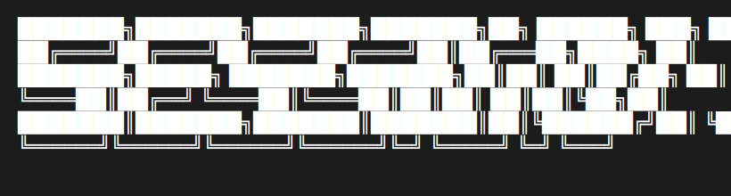
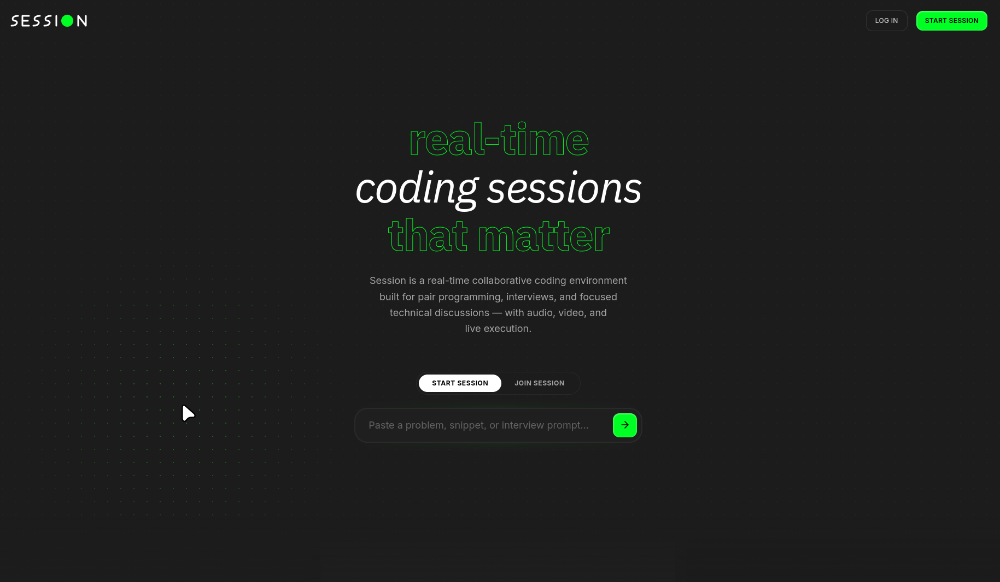
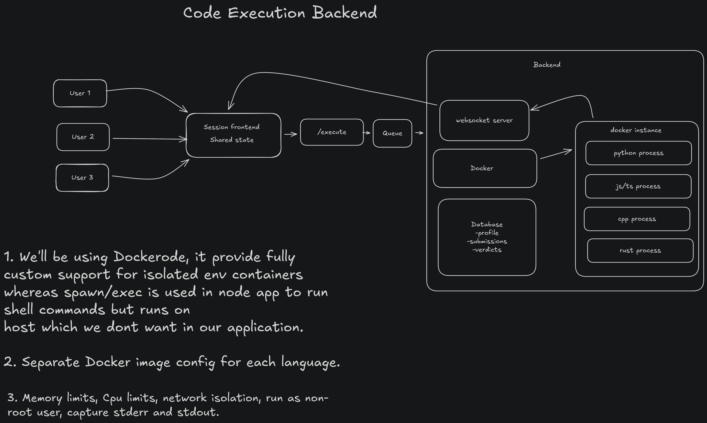

<div align="center">
  
  
  <br />
  <br />
  
  <h3>Get 10X more out of your pair programming sessions</h3>
  
  <p>A real-time collaborative coding environment built for pair programming, technical interviews, and focused coding discussions — with live code sync, AI assistance, and more.</p>

  <br />

  <p>
    <a href="https://session-ecru.vercel.app/"></a>
    
    
    
    
  </p>

  <br />
  <hr />
  <br />

  
  
  <br />
  <br />
</div>

---

## Table of Contents

- [ Features](#-features)
- [ Tech Stack](#-tech-stack)
- [ Project Structure](#-project-structure)
- [ Getting Started](#-getting-started)
  - [Prerequisites](#prerequisites)
  - [Installation](#installation)
  - [Running Locally](#running-locally)
- [ Deployment](#-deployment)
- [ Environment Variables](#-environment-variables)
- [ Contributing](#-contributing)
- [ License](#-license)

---

## Features

### Real-Time Collaborative Editor

- **Live Code Synchronization** — Powered by [Yjs](https://yjs.dev/) and WebSockets for seamless, conflict-free real-time editing
- **Monaco Editor** — The same powerful editor that powers VS Code, with syntax highlighting, IntelliSense, and more
- **Multi-language Support** — JavaScript, TypeScript, Python, Java, C++, Go, HTML, CSS, and more
- **Cursor & Selection Awareness** — See collaborators' cursors and selections in real-time with distinct colors

### AI-Powered Assistance

- **Integrated AI Chat** — Get instant help with coding problems, explanations, and suggestions
- **AI Session Bootstrapping** — Start sessions with AI-generated problem statements and starter code
- **Powered by Google Gemini** — Leveraging cutting-edge AI for intelligent code generation

### Modern, Premium UI/UX

- **Glassmorphism Design** — Beautiful translucent panels with subtle blur effects
- **Dark Mode First** — Elegant dark theme with neon green accents optimized for long coding sessions
- **Smooth Animations** — Powered by Framer Motion for delightful micro-interactions
- **Responsive Layout** — Adaptive design that works on various screen sizes

### Communication (Coming Soon)

- **WebRTC Audio Calls** — Voice communication with your pair programming partner
- **Peer-to-Peer Connection** — Low-latency audio powered by WebRTC

### Coding Interview Mode

- **Problem Panel** — Display problem statements with difficulty levels
- **Hints System** — Progressive hints to guide candidates
- **Complexity Analysis** — Show expected time and space complexity
- **Solution Reveal** — Full solution available for review

### Isolated Code Execution

- **Docker-Powered Isolation** — Run Python, JavaScript, C, and C++ code securely in ephemeral Docker containers
- **Hardened Security** — Containers run with dropped capabilities, disabled networking, and strict resource limits:
  ```json
  "HostConfig": {
    "Memory": 268435456, // 256MB
    "NanoCpus": 1000000000, // 1 CPU
    "PidsLimit": 64,
    "NetworkMode": "none",
    "CapDrop": ["ALL"],
    "SecurityOpt": ["no-new-privileges"]
  }
  ```
- **Execution Architecture** — The backend provisions, monitors, and demultiplexes `stdout`/`stderr` streams per request
- _[Planned]_ **Execution Queue** — A queue system will be implemented to throttle concurrent execution requests and prevent backend host resource exhaustion



---

## Tech Stack

### Frontend

| Technology          | Purpose                                      |
| ------------------- | -------------------------------------------- |
| **React 19**        | UI Framework with latest concurrent features |
| **TypeScript**      | Type-safe development                        |
| **Vite**            | Lightning-fast build tool and dev server     |
| **Tailwind CSS v4** | Utility-first styling                        |
| **Monaco Editor**   | Professional code editing experience         |
| **Framer Motion**   | Fluid animations and transitions             |
| **Yjs + y-monaco**  | Real-time collaborative editing (CRDT)       |
| **React Router v7** | Client-side routing                          |
| **Lucide Icons**    | Beautiful, consistent iconography            |

### Backend

| Technology           | Purpose                               |
| -------------------- | ------------------------------------- |
| **Node.js**          | Runtime environment                   |
| **Express**          | HTTP server and layered API routing   |
| **TypeScript**       | Type-safe server development          |
| **WebSocket (ws)**   | Real-time bidirectional communication |
| **y-websocket**      | Yjs WebSocket provider                |
| **Google GenAI SDK** | AI-powered content generation         |
| **OpenRouter SDK**   | Alternative AI model access           |

#### Backend Architecture

The backend follows a **production-ready layered architecture**:

```
Request Flow:
  Routes → Controllers → Services → Database/External APIs
```

**Key Patterns:**

- ️ **Modular Routing** — Routes organized by domain (e.g., `ai.routes.ts`)
- ️ **Global Error Handling** — Centralized error handler with custom `AppError` class
- **Async Safety** — `asyncHandler` middleware prevents unhandled promise rejections
- ️ **Config Layer** — All environment variables and computed config in one place
- **Clear Separation** — Controllers handle HTTP, services contain business logic

---

## Project Structure

```
session/
├──  frontend/                    # React application
│   ├──  src/
│   │   ├──  components/
│   │   │   ├──  editor/          # Editor-related components
│   │   │   │   ├── AIChat.tsx      # AI assistant chat panel
│   │   │   │   ├── CodeEditor.tsx  # Monaco editor wrapper
│   │   │   │   ├── OutputPanel.tsx # Code execution output
│   │   │   │   ├── ProblemPanel.tsx# Interview problem display
│   │   │   │   └── TopBar.tsx      # Editor toolbar
│   │   │   ├──  landing/         # Landing page components
│   │   │   │   ├── Header.tsx
│   │   │   │   ├── Hero.tsx
│   │   │   │   ├── SessionInput.tsx
│   │   │   │   ├── Marquee.tsx
│   │   │   │   └── Footer.tsx
│   │   │   └── Editor.tsx          # Main collaborative editor
│   │   ├──  hooks/               # Custom React hooks
│   │   │   └── useAudioCall.ts     # WebRTC audio functionality
│   │   ├──  pages/               # Route pages
│   │   ├── App.tsx                 # Root component with routing
│   │   ├── main.tsx                # Application entry point
│   │   └── index.css               # Global styles & design tokens
│   ├──  public/                  # Static assets
│   ├── vite.config.ts              # Vite configuration
│   ├── tailwind.config.js          # Tailwind configuration
│   └── package.json
│
├──  backend/                     # Node.js server (Layered Architecture)
│   ├──  src/
│   │   ├──  config/              # Environment & configuration
│   │   │   └── env.ts              # Centralized config with CORS
│   │   ├──  controllers/         # HTTP request handlers
│   │   │   ├── session.controller.ts
│   │   │   ├── aichat.controller.ts
│   │   │   └── execute.controller.ts
│   │   ├──  middleware/          # Express middleware
│   │   │   ├── errorHandler.ts    # Global error handling
│   │   │   └── asyncHandler.ts    # Async error safety
│   │   ├──  routes/              # Modular API routes
│   │   │   ├── ai.routes.ts       # AI-related endpoints
│   │   │   └── code.routes.ts     # Code execution endpoints
│   │   ├──  services/            # Business logic layer
│   │   │   ├── session.service.ts # AI session generation
│   │   │   ├── aichat.service.ts  # AI chat logic
│   │   │   ├── execute.service.ts # Docker code execution
│   │   │   └── yjs.service.ts     # Yjs document management
│   │   ├──  utils/               # Helper utilities
│   │   │   └── languageMapper.ts  # Language normalization
│   │   ├──  websocket/           # WebSocket handlers
│   │   │   └── socketServer.ts    # Yjs WebSocket server
│   │   ├── app.ts                  # Express app configuration
│   │   └── index.ts                # Server entry point
│   ├── tsconfig.json
│   └── package.json
│
├── README.md                       # This file
├── LICENSE                         # MIT License
```

---

## Getting Started

### Prerequisites

Before you begin, ensure you have the following installed:

- **Node.js** (v18 or higher recommended)
- **npm** or **yarn** package manager
- **Git** for version control
- **Docker** (Required for the Isolated Code Execution feature)

### Installation

1. **Clone the repository**

   ```bash
   git clone https://github.com/silky-x0/session.git
   cd session
   ```

2. **Install backend dependencies**

   ```bash
   cd backend
   npm install
   ```

3. **Install frontend dependencies**
   ```bash
   cd ../frontend
   npm install
   ```

4. **Pull required Docker images for Code Execution**
   ```bash
   docker pull python:3.11-alpine
   docker pull node:20-alpine
   docker pull gcc:latest
   ```

### Running Locally

You'll need to run both the backend and frontend servers.

#### Backend Server

```bash
cd backend

# Development mode with hot reload
npm run dev

# Or production mode
npm run build && npm start
```

The WebSocket server starts on `http://localhost:1234` by default.

#### Frontend Development Server

```bash
cd frontend

# Start development server
npm run dev
```

The frontend runs on `http://localhost:5173`. Open this URL in your browser to access Session.

#### Quick Start

1. Open `http://localhost:5173` in your browser
2. Click **"Start Session"** to create a new room
3. Share the URL with your pair programming partner
4. Start coding together in real-time!

---

## Deployment

### Production URLs

| Service               | URL                                    |
| --------------------- | -------------------------------------- |
| **Frontend (Vercel)** | https://session-ecru.vercel.app/       |
| **Backend (Render)**  | _Configured via environment variables_ |

### Backend Deployment (Render)

| Setting            | Value         |
| ------------------ | ------------- |
| **Root Directory** | `backend`     |
| **Build Command**  | `npm install` |
| **Start Command**  | `npm start`   |

### Frontend Deployment (Vercel/Render)

| Setting            | Value                                        |
| ------------------ | -------------------------------------------- |
| **Root Directory** | `frontend`                                   |
| **Build Command**  | `npm install && npm run build`               |
| **Start Command**  | `npm run start` (or serve the `dist` folder) |

---

## Environment Variables

Both the backend and frontend require environment variables to run. Example files are provided in the repository.

### Backend Setup

1. **Copy the example file:**

   ```bash
   cd backend
   cp .env.example .env
   ```

2. **Configure your variables in `backend/.env`:**

   ```env
   PORT="YOUR_PORT"
   FRONTEND_URL="YOUR_FRONTEND_URL"
   OPEN_ROUTER_KEY="YOUR_OPEN_ROUTER_API_KEY"
   ```

   | Variable          | Description                         | Example                 |
   | ----------------- | ----------------------------------- | ----------------------- |
   | `PORT`            | Port for the WebSocket/HTTP server  | `1234`                  |
   | `FRONTEND_URL`    | Frontend URL for CORS configuration | `http://localhost:5173` |
   | `OPEN_ROUTER_KEY` | API key for OpenRouter AI services  | `sk-or-v1-...`          |

### Frontend Setup

1. **Copy the example file:**

   ```bash
   cd frontend
   cp .env.example .env
   ```

2. **Configure your variables in `frontend/.env`:**

   ```env
   VITE_API_URL=http://localhost:1234
   VITE_WS_URL=ws://localhost:1234
   ```

   | Variable       | Description                       | Example                 |
   | -------------- | --------------------------------- | ----------------------- |
   | `VITE_API_URL` | Backend API URL for HTTP requests | `http://localhost:1234` |
   | `VITE_WS_URL`  | WebSocket URL for real-time sync  | `ws://localhost:1234`   |

> **️ Important:**
>
> - Never commit `.env` files to version control (they're already in `.gitignore`)
> - For production deployments, replace localhost URLs with your deployed backend URLs
> - Use `wss://` instead of `ws://` for secure WebSocket connections in production

---

## Contributing

We love contributions! Session is an open-source project, and we welcome contributors of all skill levels. Here's how you can help:

### Ways to Contribute

- **Report Bugs** — Found a bug? [Open an issue](https://github.com/silky-x0/session/issues/new)
- **Suggest Features** — Have an idea? We'd love to hear it!
- **Improve Documentation** — Help us make the docs better
- **Submit Pull Requests** — Fix bugs or implement new features
- **Write Tests** — Help improve code coverage

### Development Workflow

1. **Fork the repository**

   Click the "Fork" button at the top right of this page.

2. **Clone your fork**

   ```bash
   git clone https://github.com/YOUR_USERNAME/session.git
   cd session
   ```

3. **Create a feature branch**

   ```bash
   git checkout -b feature/your-feature-name
   # or
   git checkout -b fix/your-bug-fix
   ```

4. **Make your changes**
   - Write clean, readable code
   - Follow the existing code style
   - Add comments where necessary
   - Update documentation if needed

5. **Test your changes**

   ```bash
   # Frontend
   cd frontend
   npm run lint
   npm run build

   # Backend
   cd ../backend
   npm run build
   ```

6. **Commit your changes**

   ```bash
   git add .
   git commit -m "feat: add amazing new feature"
   ```

   We follow [Conventional Commits](https://www.conventionalcommits.org/):
   - `feat:` — New features
   - `fix:` — Bug fixes
   - `docs:` — Documentation changes
   - `style:` — Code style changes (formatting, etc.)
   - `refactor:` — Code refactoring
   - `test:` — Adding or updating tests
   - `chore:` — Maintenance tasks

7. **Push to your fork**

   ```bash
   git push origin feature/your-feature-name
   ```

8. **Open a Pull Request**

   Go to the original repository and click "New Pull Request". Fill in the template with details about your changes.

### Code Style Guidelines

- **TypeScript** — Use TypeScript for all new code
- **Formatting** — Code is formatted with default ESLint rules
- **Naming** — Use descriptive variable and function names
- **Components** — Keep React components focused and reusable
- **Comments** — Explain _why_, not _what_

### Pull Request Checklist

Before submitting a PR, please ensure:

- [ ] Code compiles without errors (`npm run build`)
- [ ] Linting passes (`npm run lint`)
- [ ] Your changes work locally
- [ ] You've updated relevant documentation
- [ ] Commit messages follow conventional commits
- [ ] PR description explains the changes clearly

### Need Help?

If you're new to open source or need guidance:

- Check out our [open issues](https://github.com/silky-x0/session/issues) for tasks labeled `good first issue`
- Feel free to ask questions in your PR or issue
- Join discussions in the repository

---

## License

This project is licensed under the **MIT License** — see the [LICENSE](LICENSE) file for details.

```
MIT License

Copyright (c) 2026 Session Contributors

Permission is hereby granted, free of charge, to any person obtaining a copy
of this software and associated documentation files (the "Software"), to deal
in the Software without restriction, including without limitation the rights
to use, copy, modify, merge, publish, distribute, sublicense, and/or sell
copies of the Software...
```

---

<div align="center">
  <br />
  <p>
    <strong>Built with  by the Session Contributors</strong>
  </p>
  <p>
    <a href="https://session-ecru.vercel.app/">Website</a>
    •
    <a href="https://github.com/silky-x0/session/issues">Report Bug</a>
    •
    <a href="https://github.com/silky-x0/session/issues">Request Feature</a>
  </p>
  <br />
  <p>
     Star this repo if you find it helpful!
  </p>
</div>
