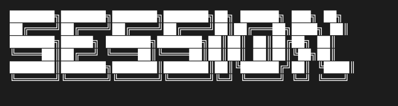
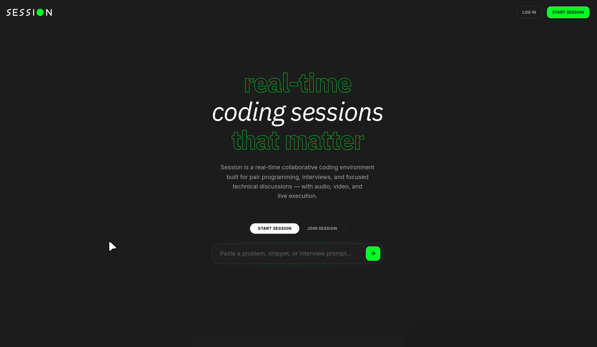

<div align="center">
  
  
  <br />
  <br />
  
  <h3>the coding room that thinks with you</h3>
  
  <p>Stop juggling tabs. Session gives interviewers and engineers a shared live IDE, AI-generated questions tuned to experience level, audio &amp; video, and post-session analysis — all from a single link. No setup. No credit card.</p>

  <br />

  <p>
    <a href="https://session-ecru.vercel.app/"></a>
    
    
    
    
  </p>

  <br />
  <hr />
  <br />

  
  
  <br />
  <br />
</div>

---

## Table of Contents

- [Features](#features)
- [Tech Stack](#tech-stack)
- [Project Structure](#project-structure)
- [Getting Started](#getting-started)
- [Documentation](#documentation)
- [License](#license)

---

## Features

| Category | What's Included |
|---|---|
| **Real-Time Collaboration** | Live code sync via Yjs + Liveblocks, Monaco Editor (VS Code engine), multi-language support, live cursors & selections with user colors |
| **AI Assistance** | AI-generated questions tuned to experience level, integrated AI chat panel, session bootstrap (problem + starter code), powered by OpenRouter (Kimi model) |
| **Code Execution** | JDoodle API (primary, cloud) + optional ephemeral Docker containers (self-hosted) — multi-language, shared output synced to all collaborators |
| **Interview Mode** | Problem panel with difficulty, hints system, complexity display, solution reveal, post-session analysis |
| **Audio & Video** | Built-in audio & video calls so interviewers and candidates share one room — no Zoom, no context switch |
| **Security** | Redis-backed Token Bucket rate limiting, dual-key (IP + Room) compound keys, ephemeral TTL cleanup, fail-open Redis fallback |
| **Premium UI/UX** | Deep Carbon & Neon Pulse design system, glassmorphism, JetBrains Mono, Framer Motion transitions, route-aware shutter animations |
| **Presence** | Avatar stack, live cursors, sync status badge, connection loss toasts |
| **Coming Soon** | Follow-me cursor, inline code comments, session playback, WebRTC audio/video |

---

## Tech Stack

### Frontend

| Technology | Purpose |
|---|---|
| **React 19** | UI framework with concurrent features |
| **TypeScript** | Type-safe development |
| **Vite** | Build tool and dev server |
| **Tailwind CSS v4** | Utility-first styling |
| **Liveblocks** | Real-time presence, CRDT sync, broadcast |
| **Monaco Editor** | VS Code-grade editor |
| **Yjs + y-monaco** | Conflict-free collaborative document |
| **Framer Motion** | Animations and route transitions |
| **React Router v7** | Client-side routing |

### Backend

| Technology | Purpose |
|---|---|
| **Node.js + Express** | HTTP server with layered routing |
| **TypeScript** | Type-safe server code |
| **Liveblocks Node SDK** | Server-side room seeding and webhook processing |
| **OpenRouter SDK** | AI model access (Kimi, etc.) |
| **JDoodle API** | Primary cloud code execution (multi-language, no Docker required) |
| **Redis + ioredis** | Token Bucket rate-limit state, BullMQ job persistence |
| **BullMQ** | Delayed job queue for ephemeral room deletion |
| **Docker SDK** | Optional ephemeral containers for self-hosted deployments |

---

## Project Structure

```
session/
├── frontend/
│   └── src/
│       ├── components/
│       │   ├── editor/           # Monaco, TopBar, AIChat, OutputPanel,
│       │   │                     # LiveCursors, AvatarStack, ConnectionToast,
│       │   │                     # BroadcastProvider, NotificationsPanel...
│       │   ├── landing/          # Hero, SessionInput, SessionLoadingScreen,
│       │   │                     # Header, Marquee, EditorShowcase,
│       │   │                     # GeneratorSection, TypographyBreak,
│       │   │                     # FeatureGallery, CinematicFooter...
│       │   ├── ui/               # hero-shutter-text, weave-spinner, link-preview
│       │   ├── Editor.tsx        # RoomProvider + CollaborativeEditorInner
│       │   └── RouteTransition.tsx
│       ├── hooks/                # useRoomSettings
│       ├── utils/                # getContrastingColor, useBoundingClientRectRef
│       ├── liveblocks.config.ts  # Presence/Storage types
│       ├── App.tsx               # Routes + editorReady state
│       └── index.css             # Design tokens, global styles
│
├── backend/
│   └── src/
│       ├── config/               # env.ts, kimi2thinking.ts
│       ├── controllers/          # session, aichat, execute
│       ├── middleware/           # errorHandler, asyncHandler, rateLimiter
│       ├── routes/               # ai.routes.ts, code.routes.ts
│       ├── services/             # session, liveblocks, aichat, execute, yjs
│       └── utils/                # languageMapper
│
├── docs/
│   ├── ARCHITECTURE.md           # System design, data flow, rate limiting, execution pipeline
│   ├── ROADMAP.md                # Completed, in-progress, and planned features
│   ├── CONTRIBUTING.md           # Workflow, code style, project-specific notes
│   ├── DEPLOYMENT.md             # Vercel + Render setup
│   └── ENV_VARS.md               # All environment variables reference
│
└── README.md
```

---

## Getting Started

### Prerequisites

- **Node.js** v18+
- **npm**
- A **Liveblocks** account (free) — get your keys at [liveblocks.io](https://liveblocks.io)
- A **JDoodle** API account — [jdoodle.com](https://jdoodle.com) (free tier available)
- An **OpenRouter** API key — [openrouter.ai](https://openrouter.ai)
- A **Redis** instance — [Redis Cloud](https://redis.io/try-free/) free tier works (required for rate limiting & room deletion queue)
- **Docker** _(optional)_ — only needed for self-hosted code execution

### Installation

```bash
git clone https://github.com/silky-x0/session.git
cd session

# Backend
cd backend
npm install
cp .env.example .env    # then fill in your keys

# Frontend
cd ../frontend
npm install
cp .env.example .env    # then fill in your keys
```


### Running Locally

```bash
# Terminal 1 — Backend (http://localhost:1234)
cd backend && npm run dev

# Terminal 2 — Frontend (http://localhost:5173)
cd frontend && npm run dev
```

Open `http://localhost:5173`, click **"Start Session"**, share the URL — done.

---

## Documentation

| Doc | Contents |
|-----|----------|
| [docs/ARCHITECTURE.md](docs/ARCHITECTURE.md) | System diagram, component tree, data flow, rate limiting design, execution pipeline |
| [docs/ROADMAP.md](docs/ROADMAP.md) | Completed features, active work, and planned backlog |
| [docs/ENV_VARS.md](docs/ENV_VARS.md) | Every environment variable for backend and frontend |
| [docs/DEPLOYMENT.md](docs/DEPLOYMENT.md) | Render + Vercel deployment instructions |
| [docs/CONTRIBUTING.md](docs/CONTRIBUTING.md) | PR workflow, code style, project-specific gotchas |

---

## License

MIT — see [LICENSE](LICENSE).

---

<div align="center">
  <br />
  <p>
    <strong>Built with ♥ by the Session Contributors</strong>
  </p>
  <p>
    <a href="https://session-ecru.vercel.app/">Website</a>
    •
    <a href="https://github.com/silky-x0/session/issues">Report Bug</a>
    •
    <a href="https://github.com/silky-x0/session/issues">Request Feature</a>
  </p>
  <br />
  <p>⭐ Star this repo if you find it helpful!</p>
</div>
