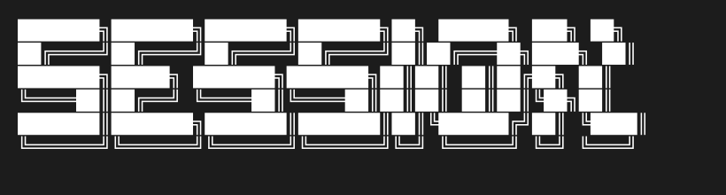
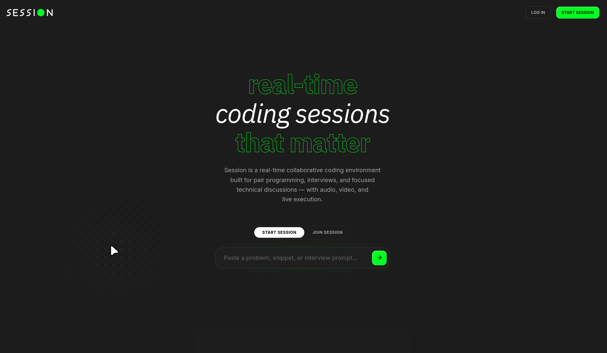

<div align="center">
  
  
  <br />
  <br />
  
  <h3>One link. Multiple questions. Zero setup.</h3>
  
  <p><strong>Session</strong> runs live coding interviews end to end. Describe the role or the topic, get a five-question set generated for the room, then interview over shared code, video, and whiteboard — with execution and review built in.</p>

  <br />

  <p>
    <a href="https://session-ecru.vercel.app/"></a>
    
    
    
    
  </p>

  <br />
  <hr />
  <br />

  
  
  <br />
  <br />
</div>

---

## Table of Contents

- [Features](#features)
- [Running an interview](#running-an-interview)
- [Tech Stack](#tech-stack)
- [Project Structure](#project-structure)
- [Getting Started](#getting-started)
- [Documentation](#documentation)
- [License](#license)

---

## Features

| Category | What you get |
|---|---|
| **Live editing** | One file, multiple cursors. Monaco (VS Code's editor) synced over Yjs + Liveblocks, in any language. |
| **AI questions** | Enter a topic ("sliding window") or a role ("senior backend, Go") on the home page. Q1 generates immediately, Q2–Q5 follow in the background. Each question gets its own code buffer, hints, difficulty, and solution. An AI chat panel lives inside the editor. Gemini by default, OpenRouter via `AI_PROVIDER`. |
| **Run code** | Execution through JDoodle against custom test cases, with a shared console and timing metrics for every run. |
| **Interview view** | Question browser with difficulty, hints, time/space notes, and revealable solutions. Presence dots show who is on which question. Failed generations show a retry button instead of dying quietly. |
| **Calls built in** | LiveKit audio and video inside the room. No separate meeting app. |
| **Whiteboard** | Shared Excalidraw board for sketching approaches together. |
| **Rate limiting** | Redis token bucket keyed by IP and room. Protected routes require a short-lived room session token (`POST /api/sessions/:roomId/token`). Fails open if Redis goes down. |
| **Presence** | Roster, live cursors, typing indicators, and sync status, with a notice on disconnect. |

Planned work (follow mode, inline comments, session playback) lives in [docs/ROADMAP.md](docs/ROADMAP.md).

---

## Running an interview

1. **Describe it.** Type a topic or paste a role on the home page and pick a nickname. A room spins up with Q1 ready; the other four questions generate while you start.
2. **Run it.** Send the link. The candidate solves in a shared Monaco editor with live cursors while you talk over built-in audio/video and sketch on the whiteboard. Either of you can switch questions independently — code per question is preserved.
3. **Review it.** Run against test cases, compare timing metrics across attempts, and open hints or the full solution when the candidate is stuck.

No accounts, no installs. A room is a link plus a nickname.

---

## Tech Stack

### Frontend

| Technology | Role |
|---|---|
| **React 19 + TypeScript + Vite** | App framework, types, dev server and builds |
| **Tailwind CSS v4** | Styling and design tokens |
| **Liveblocks** | Presence, cursors, and room sync |
| **Monaco + Yjs** | Editor engine with CRDT text sync |
| **LiveKit** | In-browser audio and video |
| **Framer Motion** | Transitions and micro-interactions |
| **React Router v7** | Routing |

### Backend

| Technology | Role |
|---|---|
| **Node.js + Express + TypeScript** | API server |
| **Liveblocks Node SDK** | Room creation and webhooks |
| **LiveKit Server SDK** | Call tokens and room setup |
| **Gemini / OpenRouter SDK** | Question generation and chat, selected by `AI_PROVIDER` |
| **JDoodle API** | Code execution without local Docker |
| **Redis + BullMQ** | Rate-limit counters and delayed room cleanup |

---

## Project Structure

```
session/
├── frontend/src/
│   ├── components/editor/    # Workspace: editor, TopBar, chat, output,
│   │                         # questions sidebar, calls, whiteboard, toasts
│   ├── components/landing/   # Marketing page sections and session entry
│   ├── components/ui/        # Shared primitives (spinners, previews)
│   ├── lib/                  # API client, LiveKit credentials
│   ├── hooks/                # Shared React hooks
│   ├── utils/                # Color helpers, DOM measurement
│   ├── liveblocks.config.ts  # Presence and storage types
│   ├── App.tsx               # Routes
│   └── index.css             # Theme tokens and global styles
│
├── backend/src/
│   ├── config/               # env, redis, Liveblocks, AI providers
│   ├── controllers/          # session, AI chat, execution, webhooks, LiveKit
│   ├── middleware/           # errors, rate limiting, room session tokens
│   ├── queues/ + workers/    # Delayed room cleanup (BullMQ)
│   ├── routes/               # ai, code, session, livekit, webhook
│   ├── services/             # AI, Liveblocks patching, execution, tokens
│   └── utils/                # language mapping, payload limits
│
├── docs/                     # architecture, roadmap, contributing,
│                             # deployment, env vars
└── README.md
```

---

## Getting Started

### Prerequisites

- **Node.js** v18+ and **npm**
- **Liveblocks** key (free): [liveblocks.io](https://liveblocks.io)
- **JDoodle** key for code execution (free tier works): [jdoodle.com](https://jdoodle.com)
- **Gemini** key ([aistudio.google.com](https://aistudio.google.com)), or **OpenRouter** key ([openrouter.ai](https://openrouter.ai)) with `AI_PROVIDER=openrouter`
- **LiveKit Cloud** project (free, only needed for calls): [cloud.livekit.io](https://cloud.livekit.io)
- **Redis** instance (free tier is enough): [redis.io/try-free](https://redis.io/try-free/)

### Installation

```bash
git clone https://github.com/silky-x0/session.git
cd session

# Backend
cd backend
npm install
cp .env.example .env    # then fill in your keys

# Frontend
cd ../frontend
npm install
cp .env.example .env    # then fill in your keys
```

### Running Locally

```bash
# Terminal 1: backend at http://localhost:1234
cd backend && npm run dev

# Terminal 2: frontend at http://localhost:5173
cd frontend && npm run dev
```

Open `http://localhost:5173`, describe a session or start empty, and send the link to whoever is joining.

---

## Documentation

| Doc | Contents |
|-----|----------|
| [docs/ARCHITECTURE.md](docs/ARCHITECTURE.md) | System design, data flow, rate limiting, execution pipeline |
| [docs/ROADMAP.md](docs/ROADMAP.md) | Done, in progress, planned |
| [docs/ENV_VARS.md](docs/ENV_VARS.md) | Every backend and frontend env var |
| [docs/DEPLOYMENT.md](docs/DEPLOYMENT.md) | Render + Vercel setup |
| [docs/CONTRIBUTING.md](docs/CONTRIBUTING.md) | PR workflow and repo conventions |

---

## License

MIT. See [LICENSE](LICENSE).

---

<div align="center">
  <br />
  <p>
    <strong>Built by the Session contributors</strong>
  </p>
  <p>
    <a href="https://session-ecru.vercel.app/">Website</a>
    •
    <a href="https://github.com/silky-x0/session/issues">Report Bug</a>
    •
    <a href="https://github.com/silky-x0/session/issues">Request Feature</a>
  </p>
  <br />
  <p>If you tried it and found it useful, a star helps.</p>
</div>
