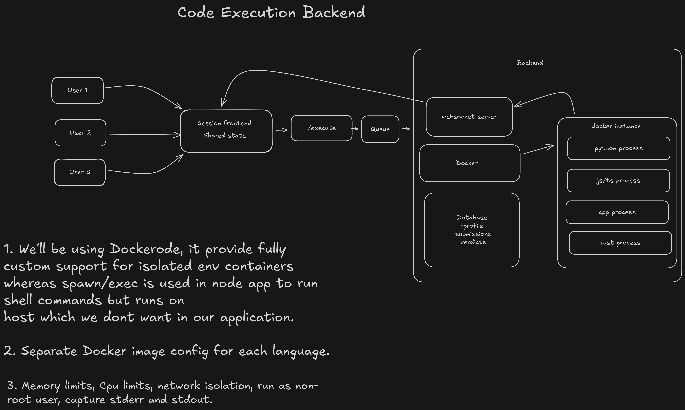

# Architecture

## Overview

Session is a full-stack monorepo with a React frontend and a Node.js/Express backend. Real-time collaboration is handled by **Liveblocks** (cloud CRDT/presence) + **Yjs** (conflict-free document model), and code execution is handled via the **JDoodle API** (ideal for serverless & PaaS cloud platforms) with an optional **Docker** container execution strategy for self-hosted setups.

```
┌─────────────────────────────────────────────────────────────┐
│                        Browser                              │
│  React 19 + Vite    Monaco Editor    Framer Motion          │
│  Liveblocks React   Yjs + y-monaco   React Router v7        │
└────────────────────────────┬────────────────────────────────┘
                             │ HTTPS / WSS
            ┌────────────────┴─────────────────┐
            │          Liveblocks Cloud         │
            │  (Room presence, Yjs storage,     │
            │   awareness, broadcast channel)   │
            └────────────────┬─────────────────┘
                             │ REST (seeding, AI)
┌────────────────────────────▼────────────────────────────────┐
│                   Express Backend (Node.js)                 │
│   Routes → Controllers → Services → External APIs          │
│                                                             │
│   ┌──────────────┐  ┌──────────────┐  ┌────────────────┐  │
│   │ session.svc  │  │  aichat.svc  │  │  execute.svc   │  │
│   │ (AI codegen  │  │ (AI chat via │  │  (JDoodle API /│  │
│   │  + LB seed)  │  │  OpenRouter) │  │   Docker)      │  │
│   └──────────────┘  └──────────────┘  └───────┬────────┘  │
└───────────────────────────────────────────────┼─────────────┘
                                                │
                 ┌──────────────────────────────┴──────────────────────────────┐
                 │                                                             │
  [Primary Cloud Execution]                                     [Self-Hosted Option]
  ┌──────────────────────────────┐                               ┌─────────────────────────────┐
  │   JDoodle REST API           │                               │    Docker Engine (host)      │
  │   https://api.jdoodle.com    │                               │  python:3.11-alpine         │
  │   (Cloud execution runner)   │                               │  node:20-alpine / gcc       │
  └──────────────────────────────┘                               └─────────────────────────────┘
```

---

## Frontend Architecture

### Component Tree

```
App.tsx
├── LiveblocksProvider          ← global room client
└── BrowserRouter
    └── AnimatedRoutes
        ├── / → RouteTransition("SESSION")
        │         └── LandingPage
        │               ├── Header
        │               ├── Hero
        │               ├── SessionInput      ← start/join flow
        │               │     └── SessionLoadingScreen (overlay)
        │               ├── Marquee
        │               └── Footer
        │
        └── /editor → RouteTransition("WORKSPACE", isReady)
                        └── CollaborativeEditor (RoomProvider)
                              └── ClientSideSuspense
                                    └── CollaborativeEditorInner
                                          ├── TopBar
                                          ├── ProblemPanel
                                          ├── CodeEditor (Monaco)
                                          ├── AIChat
                                          ├── OutputPanel
                                          ├── LiveCursors
                                          ├── ConnectionToast
                                          └── BroadcastProvider
```

### Key Patterns

| Pattern | Where | Why |
|---|---|---|
| `RouteTransition` + `isReady` prop | `App.tsx` + `RouteTransition.tsx` | Overlay stays until Liveblocks room is `"connected"` |
| `useStatus()` from Liveblocks | `CollaborativeEditorInner` | Fires `onRoomReady` when connection is live |
| `ClientSideSuspense` | `Editor.tsx` | Prevents SSR flash; shows fallback during room init |
| `BroadcastProvider` | `editor/` | Wraps editor components for Liveblocks broadcast events |
| `AnimatePresence` + `key={location.pathname}` | `App.tsx` | Enables page-level exit/enter animations |

---

## Backend Architecture

### Request Flow

```
HTTP Request
  → CORS middleware
  → /webhook branch (raw body, HMAC verify) ← exits here for webhook events
  → express.json() body parser (512 KB global cap → 413)
  → globalApiLimiter (all /api/* routes)
  → POST /api/sessions/:roomId/token (public) ← mints room session token, exits here
  → validateSessionToken on protected routes (/api/code/*, /api/ai/chat)
      401 missing/invalid/expired · 403 room mismatch · req.session = payload
  → Route-specific dual-key limiters
    → Controller (controllers/, per-field payload caps → 413)
      → Service (services/)
        → External API / JDoodle / Liveblocks Node SDK
          → Response
```

### Room Session Token Auth

The product is login-less: anyone with a room link can collaborate via Liveblocks' public key. To stop anonymous abuse of paid backend resources (JDoodle credits, AI tokens), protected REST routes require a **Room Session Token** — chosen over full User Auth to preserve the zero-friction UX:

1. Client entering the editor calls `POST /api/sessions/:roomId/token` (public, rate-limited).
2. Backend returns a short-lived (2 h) self-contained JWT (HS256, `node:crypto` — no extra deps) bound to `{ roomId, iat, exp }`, signed with `SESSION_TOKEN_SECRET` (falls back to `LIVEBLOCKS_SECRET_KEY`).
3. Every request to `/api/code/*` and `/api/ai/chat` carries `Authorization: Bearer <token>`.
4. `validateSessionToken` (`middleware/auth.ts`) verifies signature + expiry (401), that the token's room matches the request's target room resolved from `body.roomId → query.room → x-room-id → Referer` (403), then attaches the decoded payload as `req.session`. Stateless — no Redis lookup; rate limiting handles volume separately.
5. The frontend caches tokens per room in `lib/apiClient.ts` and transparently re-mints once on a 401.

Payload size limits guard individual fields before they reach paid services or get echoed in error messages: code ≤ 20 KB, stdin ≤ 10 KB, prompt ≤ 8 KB, codeContext ≤ 20 KB, language ≤ 32 chars, plus a 512 KB global JSON body cap (`entity.too.large` → 413).

### Layered Design

```
backend/src/
├── index.ts                  ← server entry, port bind
├── app.ts                    ← Express app, middleware, routes
├── config/
│   ├── env.ts                ← all env vars + CORS config
│   └── kimi2thinking.ts      ← Kimi AI model config
├── controllers/
│   ├── session.controller.ts ← POST /api/session
│   ├── aichat.controller.ts  ← POST /api/chat
│   └── execute.controller.ts ← POST /api/execute
├── middleware/
│   ├── errorHandler.ts       ← global error handler
│   ├── asyncHandler.ts       ← wraps async route handlers
│   ├── auth.ts               ← validateSessionToken (Bearer room token) middleware
│   └── rateLimiter.ts        ← Token Bucket rate limiting middleware (Redis-backed)
├── routes/
│   ├── ai.routes.ts          ← /api/session, /api/chat
│   ├── code.routes.ts        ← /api/execute
│   └── session.routes.ts     ← /api/sessions/:roomId/token
├── services/
│   ├── session.service.ts    ← AI problem gen → Liveblocks seed
│   ├── liveblocks.service.ts ← Liveblocks Node SDK wrapper
│   ├── aichat.service.ts     ← streaming AI chat
│   ├── execute.service.ts    ← JDoodle API execution (with optional Docker runner)
│   └── yjs.service.ts        ← (legacy) in-memory Yjs store
└── utils/
    └── languageMapper.ts     ← maps language names → JDoodle codes / Docker images
```

### Session Bootstrap Flow

When a user clicks **"Start Session"** with AI generation enabled:

```
1. Frontend POSTs to /api/session  { topic?, language }
2. session.service.ts calls the AI model (Kimi/OpenRouter)
3. AI returns: title, difficulty, question, hints, starterCode, fullSolution
4. liveblocks.service.ts seeds the Liveblocks room via Node SDK:
     - yDoc.getMap("meta").set(...)      ← problem metadata
     - yDoc.getText("monaco").insert()   ← starter code
5. Backend returns { roomId, ... } to the frontend
6. Frontend navigates to /editor?room=<roomId>&nickname=<name>
7. RouteTransition overlay stays until useStatus() === "connected"
```

---

## API Security & Rate Limiting

### Why Rate Limiting is Critical for This Application

Session integrates three external **paid-per-invocation** API services: JDoodle (code execution), Google Gemini (session generation), and OpenRouter (AI chat). Without rate limiting, any unauthenticated caller reaching the deployed backend can drain API credits, cause financial cost overruns, or exhaust quota limits for all legitimate users.

### Algorithm: Redis-Backed Token Bucket

> **Why Token Bucket over alternatives?**
>
> - **Fixed Window**: Vulnerable to "double-bursting" — a client can make 2× the allowed limit by clustering requests around a window reset boundary. For a paid execution API, this means overspending on each burst window reset.
> - **Leaky Bucket**: Queues requests for constant-rate processing. A bot spam attack fills the queue and the backend continues calling JDoodle/Gemini for hours after the attack ends, draining credits even after the attacker has stopped.
> - **Sliding Window Log**: Stores a timestamp for every request in a Redis sorted set — memory usage scales linearly with traffic, leading to Redis Out-of-Memory (OOM) crashes under spam.
> - **Token Bucket** (chosen): Each request consumes one token from a bucket. Tokens accumulate continuously over time up to a maximum capacity. Short legitimate bursts (e.g., a developer clicking "Run" twice quickly) are absorbed by the token buffer, while sustained spam exhausts the bucket and is blocked immediately with HTTP 429. Memory usage is constant — only two numbers (`tokens`, `lastRefill`) per IP key in Redis.

**Token math per request:**
```
newTokens = min(capacity, oldTokens + (elapsedMs × refillRate))
refillRate = capacity / refillTimeMs  (tokens per millisecond)
```

Each bucket in Redis self-expires via a TTL set equal to `refillTimeMs`, so idle users are automatically garbage-collected.

### Dual-Key (Compound Key) Pattern

IP-only rate limiting breaks down on **shared networks** (university campuses, corporate offices, home NAT routers) where multiple users appear to the server as a single public IP address. One user consuming their rate limit would block all other users on the same network.

To solve this, rate limiters operate with two independent Redis keys in series:

| Layer | Redis Key | Limit | Purpose |
|---|---|---|---|
| **Global IP** | `ratelimit:{prefix}:{ip}` | 30 runs/min | Prevents a single IP from abusing multiple rooms to multiply their limit |
| **Room-Specific** | `ratelimit:{prefix}:{ip}:{roomId}` | 5 runs/min | Ensures fair per-workspace isolation so one room's user can't block another |

Both checks must pass before a request reaches the controller:

```
Request arrives at /api/code/execute
  → globalIpCodeExecutionLimiter checks ratelimit:global-ip-code-exec:{ip}
    → (if remaining > 0) consume token, pass through
      → roomCodeExecutionLimiter checks ratelimit:room-code-exec:{ip}:{roomId}
        → (if remaining > 0) consume token, pass through
          → executeCode controller → JDoodle API
    → (if 0 remaining) reject with HTTP 429 + Retry-After header
```

The `roomId` is resolved dynamically from `req.body.roomId`, `req.query.room`, `req.headers["x-room-id"]`, or parsed from the `Referer` header URL. If no room is present (e.g., a bot hitting the endpoint directly), the key falls back to IP-only, applying the stricter room-level limit.

### Rate Limiter Inventory

| Exported Middleware | Redis Key Pattern | Capacity | Window | Applied To |
|---|---|---|---|---|
| `globalIpCodeExecutionLimiter` | `ratelimit:global-ip-code-exec:{ip}` | 30 tokens | 1 minute | `POST /api/code/execute` (per-route) |
| `roomCodeExecutionLimiter` | `ratelimit:room-code-exec:{ip}:{roomId}` | 5 tokens | 1 minute | `POST /api/code/execute` (per-route) |
| `globalIpAiServiceLimiter` | `ratelimit:global-ip-ai-service:{ip}` | 50 tokens | 1 minute | All `GET/POST /api/ai/*` (router-level) |
| `roomAiServiceLimiter` | `ratelimit:room-ai-service:{ip}:{roomId}` | 10 tokens | 1 minute | All `GET/POST /api/ai/*` (router-level) |
| `globalApiLimiter` | `ratelimit:global-api:{ip}` | 100 tokens | 15 minutes | All `/api/*` (app-level) |

### Middleware Layering in app.ts

```
HTTP Request
  → CORS middleware
  ├── /webhook → express.raw() → verifyLiveblocksWebhook → handleWebhook
  │              (bypasses json parser and all rate limiters intentionally)
  └── /api/*
        → express.json()
        → globalApiLimiter      ← app.use("/api", globalApiLimiter)
        ├── /api/ai/*
        │     → globalIpAiServiceLimiter   ← router.use()
        │     → roomAiServiceLimiter       ← router.use()
        │     → /session → createAiSession controller
        │     → /chat    → chatWithAI controller
        └── /api/code/*
              → /execute
                  → globalIpCodeExecutionLimiter  ← per-route
                  → roomCodeExecutionLimiter       ← per-route
                  → executeCode controller
```

> **Fail-Open Behaviour**: If Redis is unreachable (connection error), the rate limiter logs the error and calls `next()` — requests are allowed through rather than failing closed. This prioritises availability for users over security during Redis downtime. For production hardening, consider adding a secondary in-memory fallback limiter.

---


## Real-Time Collaboration

### Yjs + Liveblocks

- **`Y.Text("monaco")`** — the shared code document, bound to Monaco via `MonacoBinding`
- **`Y.Map("meta")`** — shared metadata (title, difficulty, language, hints, solution)
- **`Y.Array("output")`** — shared execution output visible to all collaborators
- **`Y.Map("execution")`** — distributed lock to prevent concurrent execution
- **Awareness** — user cursor position, color, and nickname synced via Liveblocks presence

### Presence Shape

```ts
// liveblocks.config.ts
type Presence = {
  cursor: { x: number; y: number } | null;
  isTyping: boolean;
  selectedLineNumber: number | null;
  info: { name: string; color: string };
};
```

---

## Code Execution Pipeline

Session supports code execution via two distinct execution engines: **JDoodle API** (Primary Cloud Execution) and **Docker Container Runner** (Self-Hosted Execution).

### Execution Strategy & Architectural Decision

> **Why switch to JDoodle API for cloud deployments?**
>
> Most managed PaaS and serverless platforms—including Render, Railway, AWS Lambda, and Heroku—allow applications to be deployed as containers but do not provide ordinary application workloads with access to a host Docker daemon or Docker socket, so Docker-in-Docker and spawning sibling containers are generally not supported. Some platforms provide specialized sandboxed environments that support nested container execution; for example, Vercel Sandbox can run Docker inside an isolated Firecracker microVM.
> 
> By switching to the **JDoodle API** (`https://api.jdoodle.com/v1/execute`), code execution runs securely via external cloud sandboxes, eliminating host Docker dependencies and enabling zero-friction deployment on services like Render and Vercel.
>
> **Retaining both strategies**:
> - **JDoodle API** (Primary / Default): Designed for cloud platform deployments without Docker daemon access. Executes multi-language code out-of-the-box using API key credentials (`JDOODLE_CLIENT_ID` / `JDOODLE_CLIENT_SECRET`).
> - **Docker Ephemeral Containers** (Self-Hosted): Retained for self-hosted VPS/VM infrastructure (e.g., AWS EC2, DigitalOcean, Hetzner) where root/Docker socket permissions are available for local container isolation.

---

### Primary Flow: JDoodle API Execution

```
User clicks "Run"
  → OutputPanel sends Liveblocks broadcast "execute"
    → BroadcastProvider receives broadcast
      → POST /api/execute  { code, language, stdin? }
        → execute.service.ts
          → Map language & version index (languageMapper)
          → Strip JS/TS export declarations for script runner
          → POST https://api.jdoodle.com/v1/execute
            → JSON response { output, statusCode, memory, cpuTime }
              → Y.Array("output").push(...)   ← synced across collaborators
```

---

### Alternative Flow: Ephemeral Docker Container Execution (Self-Hosted)

```
User clicks "Run"
  → OutputPanel sends Liveblocks broadcast "execute"
    → BroadcastProvider receives broadcast
      → POST /api/execute  { code, language }
        → execute.service.ts
          → docker.run(image, code)   ← ephemeral container
            → stream stdout/stderr    ← demultiplexed
              → response chunks
                → Y.Array("output").push(...)   ← synced to all users
```

<br>

> The diagram below illustrates the full Docker execution lifecycle — from the browser "Run" click, through the Express backend, to the ephemeral container and back.

<br>



#### Container Constraints (Docker Mode)

```json
{
  "Memory": "256MB",
  "NanoCpus": 1,
  "PidsLimit": 64,
  "NetworkMode": "none",
  "CapDrop": ["ALL"],
  "SecurityOpt": ["no-new-privileges"]
}
```

> **Note**: In Docker mode, execution queues can be used to throttle concurrent container requests and prevent host resource exhaustion.

---

## Room Lifecycle & Ephemeral Cleanup

Rooms are created by the AI session service and are considered **ephemeral** — they should be automatically deleted when all users leave and nobody returns within 15 minutes.

### Overview


### Components

| File | Role |
|---|---|
| `middleware/verifyLiveblocksWebhook.ts` | Verifies Liveblocks HMAC webhook signature using raw request body |
| `controllers/webhook.controller.ts` | Dispatcher — routes `userLeft` / `userEntered` events to their handlers |
| `controllers/userleft.controller.ts` | Schedules room deletion when `numActiveUsers === 0` |
| `controllers/userentered.controller.ts` | Cancels pending deletion when a user re-enters |
| `queues/roomDeletion.queue.ts` | BullMQ queue — `scheduleRoomDeletion()` + `cancelRoomDeletion()` helpers |
| `workers/roomDeletion.worker.ts` | Processes fired jobs — safety re-check + `liveblocks.deleteRoom()` |
| `config/redis.ts` | Shared IORedis connection (`maxRetriesPerRequest: null` required by BullMQ) |

### Deletion Flow

```
Liveblocks → POST /webhook
  → verifyLiveblocksWebhook (HMAC check)
    → handleWebhook (event type dispatcher)

[userLeft, numActiveUsers === 0]
  → scheduleRoomDeletion(roomId, 15min)
    → BullMQ: queue.add(roomId, { roomId }, { jobId: roomId, delay: 15min, attempts: 3 })
      → Job persisted in Redis (survives server restarts)

[userEntered]
  → cancelRoomDeletion(roomId)
    → BullMQ: queue.remove(roomId)  ← no-op if job already fired/gone

[Job fires after 15min delay]
  → roomDeletion.worker.ts processor
    → liveblocks.getActiveUsers(roomId)
      → if users present → abort (log DELETION_ABORTED)
      → if empty → liveblocks.deleteRoom(roomId)
        → success: log DELETION_SUCCESS
        → failure: re-throw → BullMQ retries (3x, exponential backoff: 5s base)
```

### Key Design Decisions

- **Idempotency via `jobId: roomId`** — BullMQ silently rejects a second `queue.add()` with the same `jobId` if the job is still pending. Safe to call `scheduleRoomDeletion` multiple times for the same room.
- **Redis persistence** — delayed jobs survive backend restarts. A `setTimeout` alternative would lose all pending timers on every deploy.
- **Safety re-check in the worker** — the 15-minute window is a race condition surface. A user could re-enter after the job fires but before `cancelRoomDeletion` ran. The `getActiveUsers` check guards against deleting an occupied room.
- **Exponential backoff** — on Liveblocks API failure, BullMQ waits 5s → 10s → 20s before retrying (up to 3 attempts total).
- **Worker started as side-effect import** — `index.ts` uses `import "./workers/roomDeletion.worker"` — the `Worker` constructor starts listening on import, no explicit `.run()` call needed. Same pattern as `initializeWebSocketServer`.

